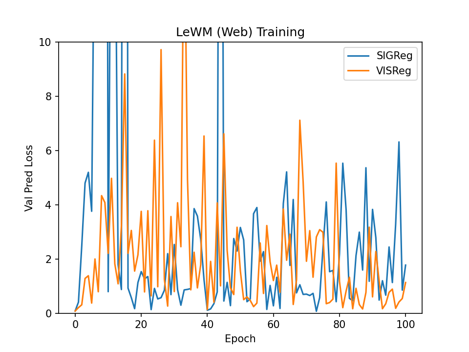

# LeWM (Web)
### A Visual Latent World Model for Web UI Navigation

Built on [LeWorldModel](https://github.com/lucas-maes/le-wm) (JEPA + SIGReg/VISReg), extended to web UI interaction.

---

## Quick Start

```bash
# Train with SIGReg (default)
python train.py --config-name web_lewm

# Train with VISReg
python train.py --config-name web_lewm \
    loss.sigreg.weight=0.0 loss.visreg.weight=4.5 optimizer.lr=6e-5
```

---

## Local Setup

### Requirements
- Python 3.11+
- PyTorch 2.5+ with CUDA 12.4 (or CPU for testing)
- Linux with CUDA 12.4+ (recommended)

### 1. Clone the repo

```bash
git clone https://github.com/Anurag9Dhiman/le-wm.git
cd le-wm
git checkout anurag/web-lewm
```

### 2. Install dependencies

```bash
pip install torch torchvision --index-url https://download.pytorch.org/whl/cu124
pip install "stable-worldmodel[train]==0.0.6"
pip install lancedb "pyarrow>=21.0.0" zstandard imageio huggingface_hub
```

Install `stable-pretraining` from source:
```bash
git clone https://github.com/Anurag9Dhiman/stable-pretraining.git
pip install -e stable-pretraining
```

### 3. Get the dataset

Download `openapps_all.lance` and set the path:
```bash
export LOCAL_DATASET_DIR=/path/to/datasets   # must contain openapps_all.lance
```

Or collect your own data (requires [OpenApps](https://github.com/taj-gillin/OpenApps) running):
```bash
python data/collect_open_apps.py \
    --base-url http://localhost:5001 \
    --apps todo calendar messenger \
    --num-episodes 200 --episode-len 48 \
    --output-dir datasets/
```

### 4. Train

```bash
# Smoke test (3 epochs, no dataset needed — uses mock data)
python train.py --config-name web_lewm trainer.max_epochs=3

# Full training — SIGReg
python train.py --config-name web_lewm

# Full training — VISReg
python train.py --config-name web_lewm \
    loss.sigreg.weight=0.0 loss.visreg.weight=4.5 optimizer.lr=6e-5
```


---

## HPCE Setup (IITM Param Rudra)

### 1. SSH and clone

```bash
ssh <username>@para.hpce.iitm.ac.in
git clone https://github.com/Anurag9Dhiman/le-wm.git /scratch/$USER/le-wm
cd /scratch/$USER/le-wm
git checkout anurag/web-lewm
```

### 2. Run setup script

Creates conda env with Python 3.11, installs all deps:
```bash
bash hpce/setup.sh
```

### 3. Upload dataset

From your local machine:
```bash
rsync -avP /path/to/openapps_all.lance \
    <username>@para.hpce.iitm.ac.in:/scratch/$USER/datasets/
```

### 4. Submit training jobs

```bash
cd /scratch/$USER/le-wm

sbatch hpce/train.slurm          # SIGReg
sbatch hpce/train_visreg.slurm   # VISReg
```

### 5. Monitor

```bash
squeue -u $USER
tail -f /scratch/$USER/logs/lewm_web_<jobid>.log
```

Checkpoints saved to `/scratch/$USER/checkpoints/`:
- `web_lewm/weights_best.pt` — SIGReg best
- `web_lewm_visreg/weights_best.pt` — VISReg best

---

## Architecture

| Component | Details |
|-----------|---------|
| Encoder | ViT-S/14, 384-dim, trained from scratch |
| Action Encoder | WebActionEncoder — 8 action types, 20-dim input, char-level text |
| Predictor | ARPredictor — causal autoregressive transformer, 5 context frames |
| Regularizer | SIGReg (default) or VISReg (switchable via config) |

**Action space** — 8 types: noop, click, type, scroll, navigate, hover, drag, key_press.
Each action encoded as a 20-dim float vector: `[type, x, y, scroll_x, scroll_y, text×15]`.
Text is character-level encoded (`ord(ch)/255.0`), zero-padded to 15 chars.

**Encoder** — ViT-S/14 trained from scratch (no pretrained weights).
Representations are tuned to web UI structure rather than natural images.

---

## Configuration

All hyperparameters in `config/train/web_lewm.yaml`. Key settings:

```yaml
history_size: 5                    # context frames fed to predictor
num_preds: 1                       # steps predicted ahead
loader.batch_size: 64              # per-GPU batch
trainer.accumulate_grad_batches: 4 # effective batch = 256
optimizer.lr: 3e-5                 # tuned for A100 + effective batch 256
trainer.precision: bf16-mixed      # requires Ampere GPU (A100, A10, etc.)
```

**Switch regularizer via CLI overrides:**
```bash
# SIGReg (default) — weight=0.05
python train.py --config-name web_lewm

# VISReg — weight=4.5, 2x higher LR
python train.py --config-name web_lewm \
    loss.sigreg.weight=0.0 \
    loss.visreg.weight=4.5 \
    optimizer.lr=6e-5
```

---

## Results (IITM Param Rudra, A100 80GB)

| Regularizer | Best Val pred_loss | Epochs | Time |
|-------------|-------------------|--------|------|
| SIGReg | **0.0746** | 100 | ~3.5 hrs |
| VISReg | 0.0829 | 100 | ~3.5 hrs |

Batch=64, gradient accumulation=4 (effective batch=256), lr=3e-5 (SIGReg) / 6e-5 (VISReg).



---

## Files

```
le-wm/
├── train.py                      # training entry point
├── module.py                     # JEPA, SIGReg, VISReg, WebActionEncoder, MLP
├── utils.py                      # checkpoint callback, normalizers
├── jepa.py                       # JEPA model
├── data/
│   ├── lance_dataset.py          # LanceDB dataset loader for OpenApps
│   ├── collect_open_apps.py      # trajectory collection script
│   └── web_action.py             # action space definitions (20-dim encoding)
├── config/train/
│   ├── web_lewm.yaml             # main training config
│   ├── data/web.yaml             # dataset config
│   └── model/web_lewm.yaml       # model architecture config
└── hpce/
    ├── setup.sh                  # cluster environment setup (conda, deps)
    ├── train.slurm               # SIGReg SLURM job
    └── train_visreg.slurm        # VISReg SLURM job
```

---

## Differences from Base LeWM

| Feature | Base LeWM | LeWM (Web) |
|---------|-----------|------------|
| Domain | 2D/3D control tasks | Web UI navigation |
| Dataset | HDF5 (tworoom, pusht) | LanceDB (OpenApps) |
| Action space | Continuous control | 8 web action types + text |
| Regularizers | SIGReg | SIGReg + VISReg |
| Cluster setup | venv + Python 3.10 | Conda + Python 3.11 |
